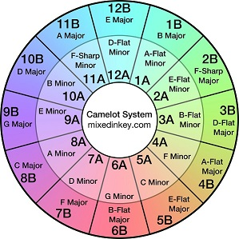
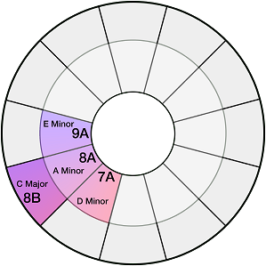
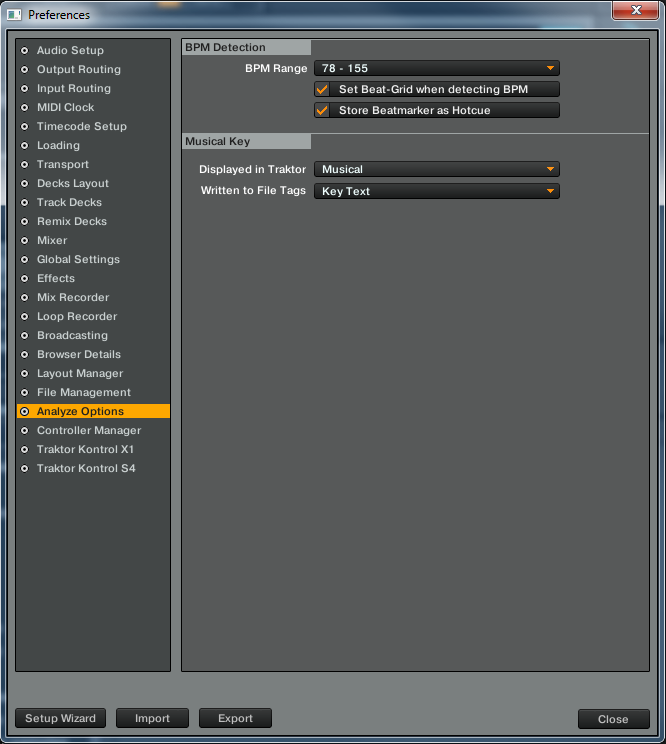
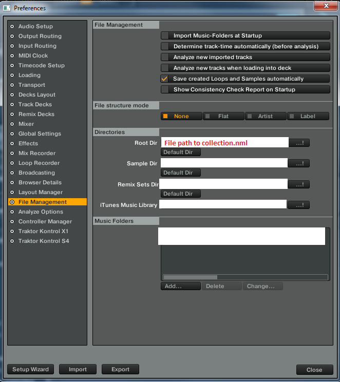

# Add Camelot keys to Native Instruments Traktor 2

Using Traktors key analysis with Mixed In Key's Camelot System, this tool writes the Camelot Key to the "Key Text" column. 

 

## Requirements

Windows 7/10 and Traktor 2. Will come out with a Mac version soon.

If you havent' done so already, Analyze your tracks in Traktor.

Also, set the musical key options, go to Preferences - Analyze Options and set
Displayed in Traktor = Musical
Written to File Tags = Key Text

## Installation

Download the tool to your computer and run it by double clicking.

## How to use

1. Run the tool, it will prompt for the full path of your collecton.nml file. See below screenshot if you don't know where the collection.nml file is located.
2. The tool will create a backup to the same folder location with the timestamp appended (ex. collection.nml180904-030205)
3. The tool will replace the "Key Text" field with the Camelot Key
4. If something goes wrong, delete collection.nml, and restore from backup by renaming the backup file to collection.nml.

How to find your collection.nml file

## Development setup

TBD

## Release History

* 0.0.1
    * Work in progress

## Contributing

TBD
